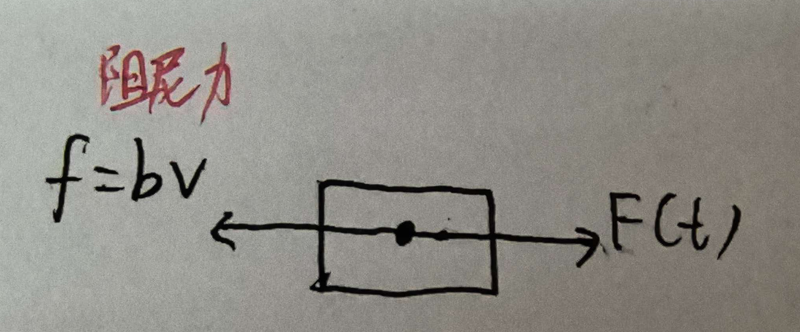
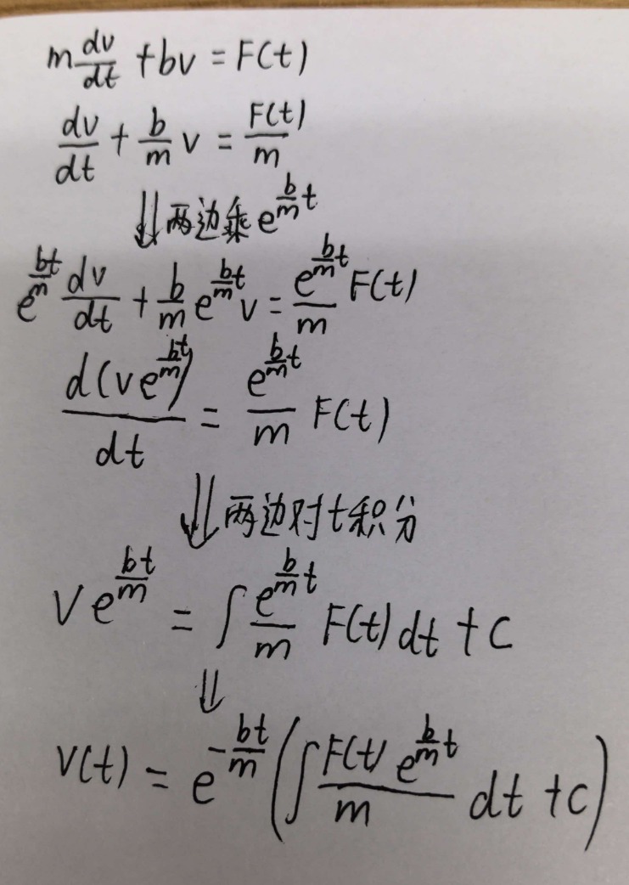
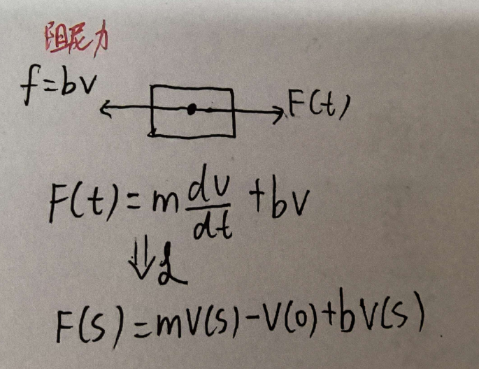
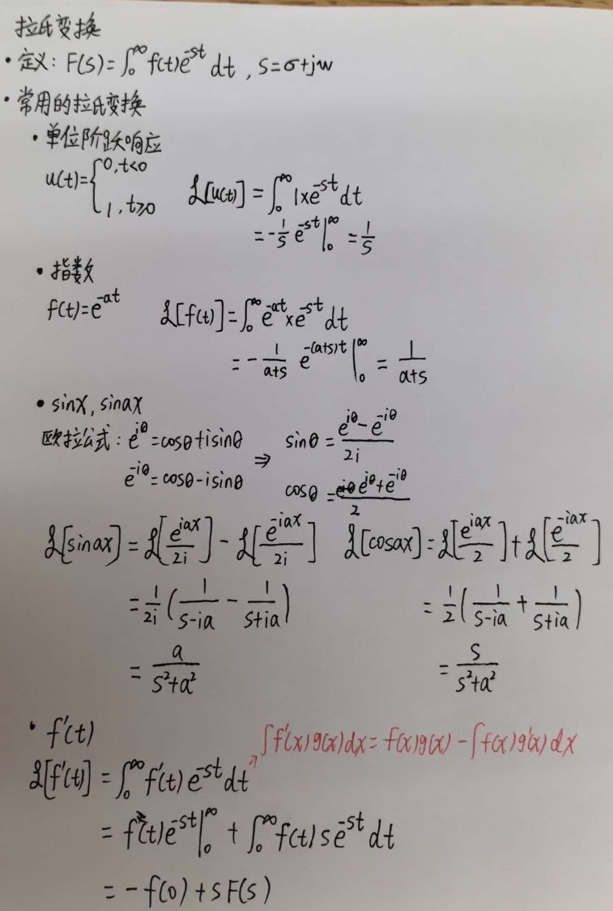

# 为什么需要拉普拉斯变换

在控制领域，我们经常需要面对微分方程，比如一个简单的质量-阻尼系统。  
外力 F(t) 随时间变化，我们希望知道物块速度 v(t) 的变化规律。

根据牛顿第二定律，a = dv/dt，受力分析得到：

m·dv/dt + b·v = F(t)

这是一个一阶线性微分方程。

## 直接求解的困境

如果直接解这个方程。  

可以看到，即使是一阶系统，求解过程也比较繁琐。如果 F(t) 复杂，积分会非常困难。这里保留了 F(t) 的一般形式，如果给定具体输入，还需要继续积分。

## 拉普拉斯变换的简化

对同一个方程两边取拉普拉斯变换（假设零初始条件，即 v(0)=0）：

整理得到：

(ms + b)V(s) = F(s)  →  V(s) = F(s)/(ms+b)

不再有导数，只剩下乘法和除法。需要时查表反变换即可。

所以拉普拉斯变换的核心价值是：把微积分运算变成代数运算。  
在二阶及高阶系统中，这个优势会更明显。

# 常用拉普拉斯变换推导过程

