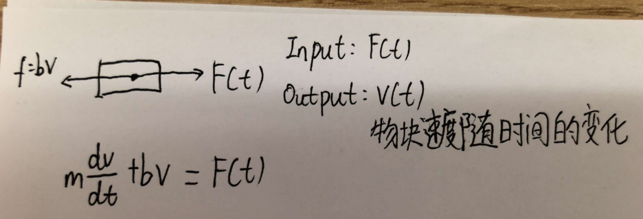
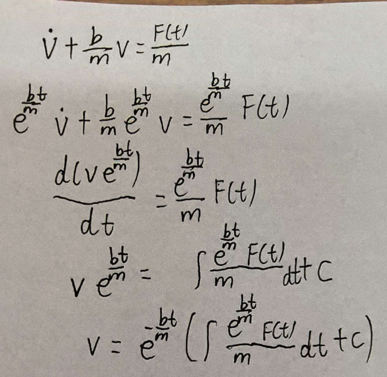
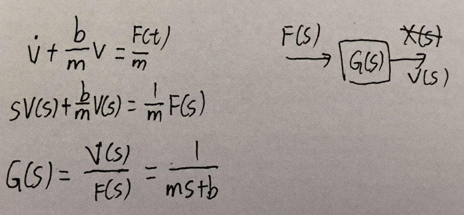
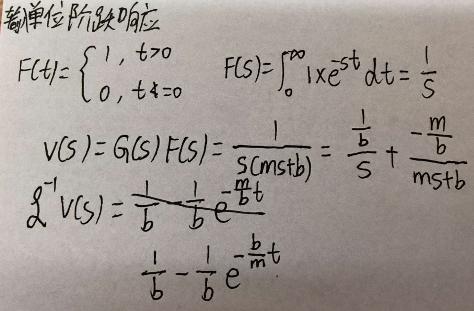

# 一阶系统的传递函数分析：从微分方程到传递函数

## 1. 问题：怎么求输出？

考虑一个简单的质量-阻尼系统：物块质量为 \(m\)，阻尼系数为 \(b\)，受到随时间变化的外力 \(F(t)\)，我们关心的是物块速度 \(v(t)\) 如何变化。

根据牛顿第二定律，得到微分方程：

$$ m\frac{dv}{dt} + bv = F(t) $$

这里输入是外力 \(F(t)\)，输出是速度 \(v(t)\)。  
问题来了：给定任意一个 \(F(t)\)，怎么求出 \(v(t)\)？

---

## 2. 直接解微分方程

用积分因子法，可以得到通解：

$$ v(t) = e^{-\frac{b}{m}t} \left( \int \frac{F(t)}{m} e^{\frac{b}{m}t} dt + C \right) $$

这个表达式里还有一个积分，只有给定具体的 \(F(t)\)，才能继续算下去。  
也就是说，每换一个输入，就要重新解一次方程，非常麻烦。

---

## 3. 拉普拉斯变换引入传递函数

为了避免反复解微分方程，我们对方程两边取拉普拉斯变换。假设零初始条件 \(v(0)=0\)：

$$ sV(s) + bV(s)/m = F(s)/m $$

合并同类项：

$$ V(s) = \frac{1}{ms+b} F(s) $$

定义传递函数：

$$ G(s) = \frac{V(s)}{F(s)} = \frac{1}{ms+b} $$

传递函数只与系统本身的参数 \(m\)、\(b\) 有关，与输入 \(F(t)\) 无关。  
这意味着：无论输入怎么变，系统对输入的“响应方式”都由 \(G(s)\) 决定。

---

## 4. 具体输入：单位阶跃响应

假设输入是单位阶跃力 \(F(t)=1\)（\(t>0\)），则 \(F(s) = \frac{1}{s}\)。

于是输出为：

$$ V(s) = G(s)F(s) = \frac{1}{ms+b} \cdot \frac{1}{s} = \frac{1}{s(ms+b)} $$

对 \(V(s)\) 做部分分式展开：

$$ \frac{1}{s(ms+b)} = \frac{1}{b}\cdot\frac{1}{s} - \frac{1}{b}\cdot\frac{1}{s+\frac{b}{m}} $$

逆变换得到时域响应：

$$ v(t) = \frac{1}{b}\left(1 - e^{-\frac{b}{m}t}\right) $$

这就是一阶系统的单位阶跃响应，速度从 0 开始指数上升，最终稳定在 \(1/b\)。

---

## 5. 和直接求解对比

| 方法 | 步骤 | 换输入时 |
|:---|:---|:---|
| 直接解微分方程 | 构造积分因子，积分，代入初始条件 | 需要重新解一遍 |
| 传递函数法 | 先求出 \(G(s)\)，再用 \(V(s)=G(s)F(s)\) | 只需替换 \(F(s)\)，重新逆变换 |

可以看到，传递函数把“解微分方程”变成了“代数运算 + 查表逆变换”。  
系统越复杂，这种优势越明显。

---

## 6. 总结

- **传递函数是什么？**  
  它是零初始条件下，输出拉氏变换与输入拉氏变换之比，只由系统本身决定。

- **它解决了什么问题？**  
  把微分方程变成代数方程，让输入和系统解耦。换输入时不需要重新解微分方程，只需要改变 \(F(s)\) 再逆变换。

- **核心思想**：  
  系统对输入的作用，可以完全由传递函数 \(G(s)\) 描述。  
  时域里是微积分，\(s\) 域里就是乘除法。

