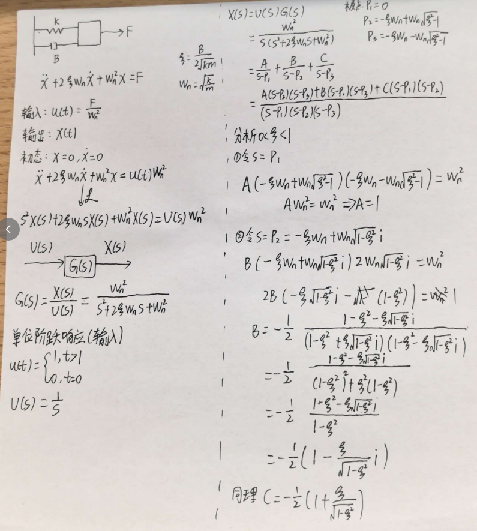
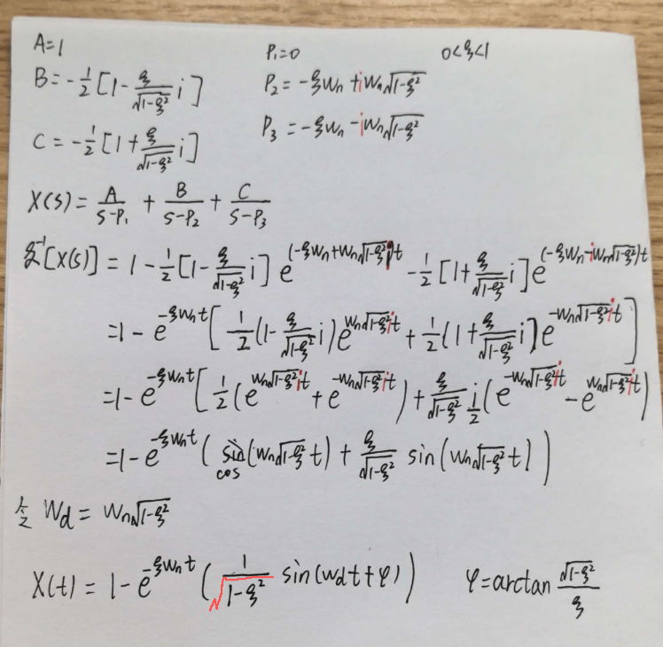
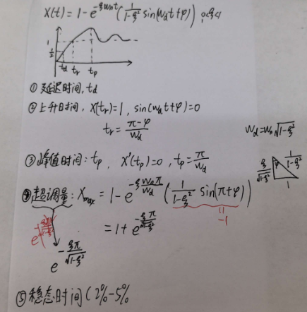
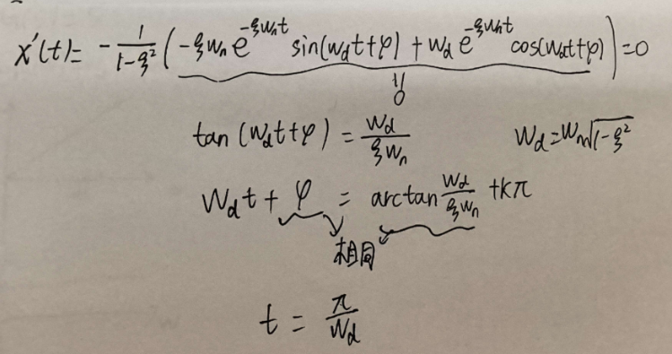

# 二阶系统的时域性能分析（单位阶跃响应）

## 1. 数学推导

### 推导体会
1. **极点与时域响应的直接联系**：传递函数非常方便，它的极点直接决定了时域输出中指数项的形式（$e^{p_i t}$）。实部决定衰减快慢，虚部决定振荡频率。
2. **欧拉公式是座桥梁**：在欠阻尼（$0<\zeta<1$）情况下，极点是一对共轭复数。计算部分分式展开时会出现复数项，但利用欧拉公式 $e^{\pm j\theta} = \cos\theta \pm j\sin\theta$，最后完美抵消虚部并合并成了一个带有相位角的衰减正弦波：

$$
x(t) = 1 - \frac{e^{-\zeta\omega_n t}}{\sqrt{1-\zeta^2}} \sin(\omega_d t + \varphi)
$$

---

## 2. 性能指标：从曲线到公式

有了 $x(t)$ 的解析式，我们就能精确计算出工程上用来衡量系统“快不快、稳不稳”的核心指标。**（这里讨论 $0<\zeta<1$ 的欠阻尼情况，这是唯一会产生超调的情况）**

### （1）延迟时间 $t_d$：输出达到目标的 50%

### （2）上升时间 $t_r$：输出第一次达到目标值（100%）
令 $x(t_r) = 1$（稳态值），也就是让正弦项为 0。解得：

$$
t_r = \frac{\pi - \varphi}{\omega_d} 
$$

阻尼比 $\zeta$ 越小，振荡频率 $\omega_d$ 越大，上升时间越短，系统初始爬升越快。

### （3）峰值时间 $t_p$：输出达到第一个峰值的时间

令 $x(t)$ 的导数 $\dot{x}(t) = 0$，解得第一个峰值时间：

$$
t_p = \frac{\pi}{\omega_d} = \frac{\pi}{\omega_n\sqrt{1-\zeta^2}}
$$

这是系统第一次“冲过头”到达最高点的时间，完全由阻尼振荡频率 $\omega_d$ 决定。

### （4）超调量 $\sigma\%$：最大偏离度
把 $t_p$ 代回 $x(t)$，算出来的峰值是 $x(t_p) = 1 + e^{-\frac{\pi\zeta}{\sqrt{1-\zeta^2}}}$。

**这里有个容易踩坑的细节：**
我们求的“超调量”是**相对量**，它代表“峰值超出稳态值的百分比”。稳态值是 1，所以必须把峰值减去 1，再除以稳态值 1：

$$
\sigma\% = \frac{(1 + e^{-\frac{\pi\zeta}{\sqrt{1-\zeta^2}}}) - 1}{1} \times 100\% = e^{-\frac{\pi\zeta}{\sqrt{1-\zeta^2}}} \times 100\%
$$

公式里那个指数项，本身就是减去 1 之后的结果。超调量只和阻尼比 $\zeta$ 有关，与固有频率 $\omega_n$ 无关。

### （5）调节时间（稳态时间）$t_s$：进入并保持在误差带内
看指数包络线衰减到指定误差带（通常取 2% 或 5%）：

$$
t_s \approx \frac{4}{\zeta\omega_n} \quad (\text{2\%误差带})
$$

$$
t_s \approx \frac{3}{\zeta\omega_n} \quad (\text{5\%误差带})
$$

调节时间近似反比于 $\zeta\omega_n$（也就是极点到虚轴的距离）。极点越往左推，系统收敛越快。

---

## 3. 总结

| 性能指标 | 计算方式（欠阻尼） | 主要影响因素 | 物理意义 |
| :--- | :--- | :--- | :--- |
| 延迟时间 $t_d$ | --- | $\omega_n, \zeta$ | 初始反应速度 |
| 上升时间 $t_r$ | $t_r = \frac{\pi - \varphi}{\omega_d}$ | $\omega_n, \zeta$ | 第一次到达目标快慢 |
| 峰值时间 $t_p$ | $t_p = \frac{\pi}{\omega_d}$ | $\omega_n, \zeta$ | 到达第一波峰快慢 |
| 超调量 $\sigma\%$ | $\sigma\% = e^{-\frac{\pi\zeta}{\sqrt{1-\zeta^2}}} \times 100\%$ | **仅 $\zeta$** | 冲过头多少 |
| 调节时间 $t_s$ | 约 $4/\zeta\omega_n$ (2%) | **$\zeta\omega_n$ (极点实部)** | 最终停下来的快慢 |

---