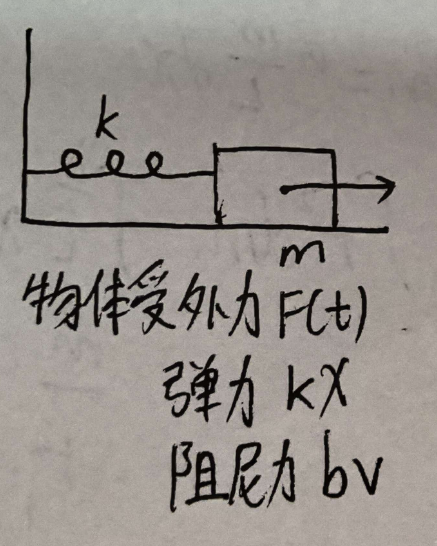
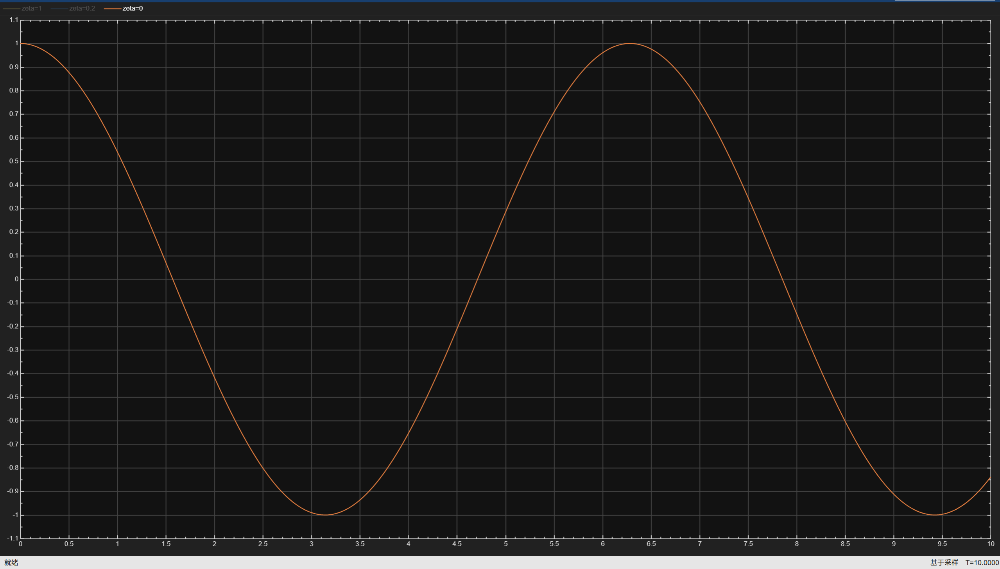
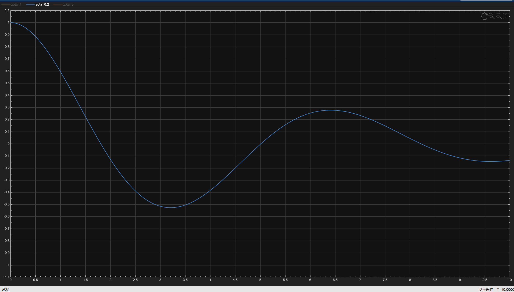
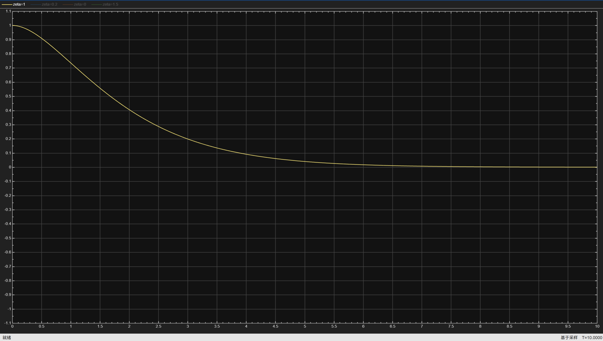
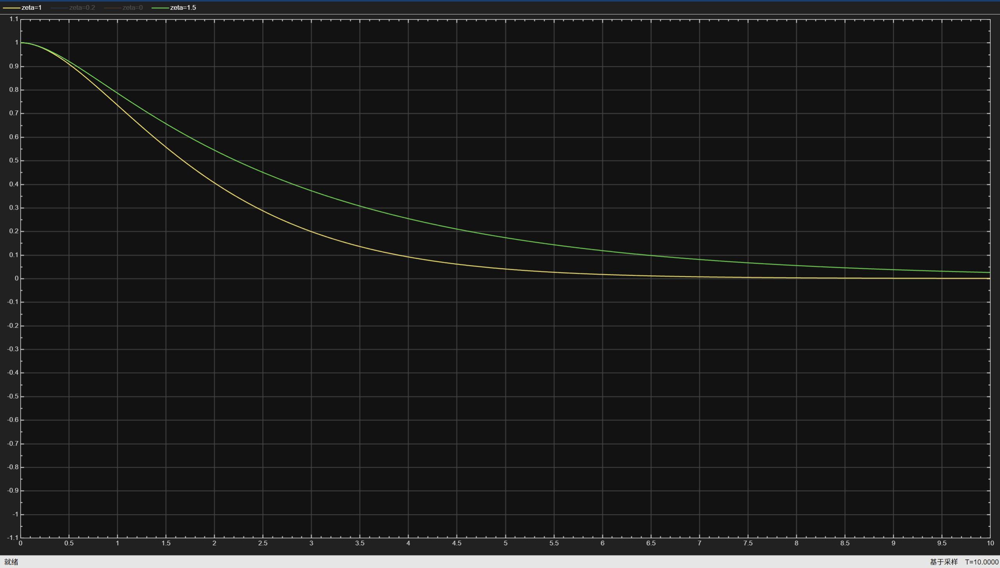
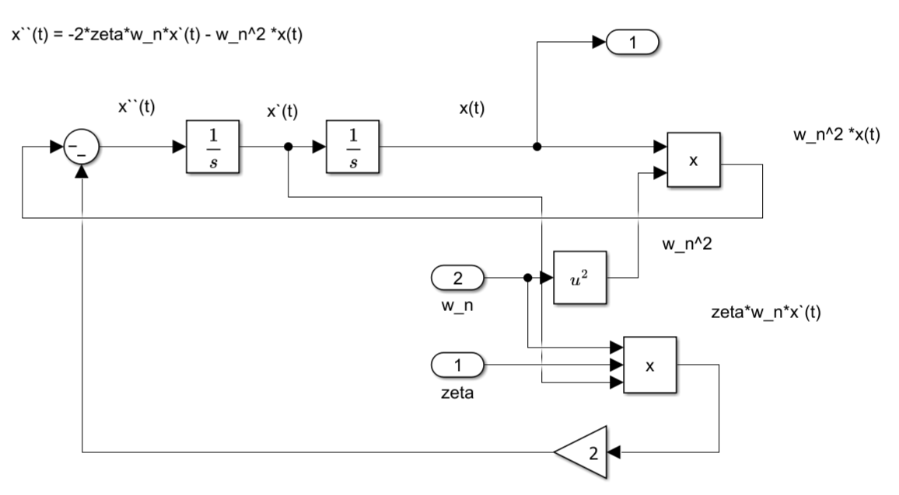
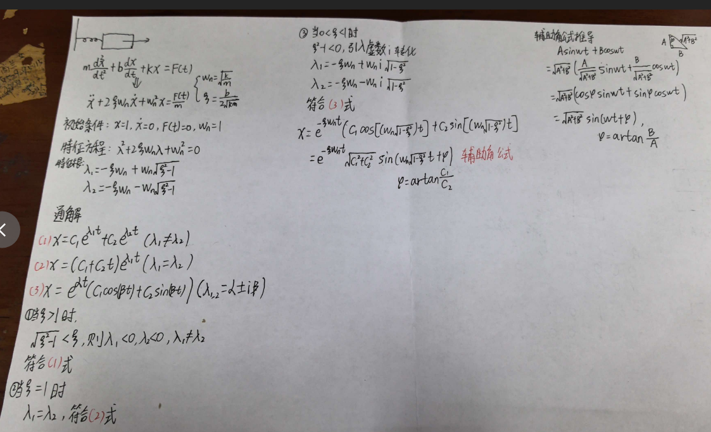

# 二阶系统的自由响应

> 大一背的二阶微分方程的解，在这一刻突然有了回音。  
> 一个质量-弹簧-阻尼系统，拉一下松手，它会来回震荡，慢慢停下。  
> 那它到底是怎么停下的？什么时候会震荡？什么时候直接回到原位？  
> 这篇笔记简单探讨一下。

---

## 1. 情景

物块质量为 m，弹簧刚度 k，阻尼系数 b。  
我们把物块拉离平衡位置，然后松手。  
松手后没有外力了，物块只受弹簧力和阻尼力，自己慢慢运动。

---

## 2. 建立方程

根据牛顿第二定律：

$$ m\frac{d^2x}{dt^2} + b\frac{dx}{dt} + kx = 0 $$

这里外力 F(t) = 0，因为松手后没有外力。  
x(t) 是物块偏离平衡位置的位移。

---

## 3. 初始条件：拉一下再松手

我们假设：

- 初始位移 x(0) = 1 m，表示把物块拉到 1 米处；
- 初始速度 x'(0) = 0，表示松手瞬间没有速度。

所以方程是齐次的，但初始条件不为零，系统会自己动起来。

---

## 4. 为什么要引入 ζ 和 ωₙ？

方程里同时出现 m、b、k 三个参数，直接分析很麻烦。  
我们想用更少的参数描述系统本质。

### ωₙ：固有频率

如果系统没有阻尼（b = 0），方程变成：

$$ m\frac{d^2x}{dt^2} + kx = 0 $$

物块会以固定频率来回震荡，这个频率就是：

$$ \omega_n = \sqrt{\frac{k}{m}} $$

它只由质量和弹簧决定，与初始条件无关。

### ζ：阻尼比

阻尼到底“多大”才算大？不能只看 b 的绝对数值。  
同样 b = 5，如果弹簧很硬、质量很大，可能还算小阻尼；如果弹簧很软，可能就是大阻尼。  
所以把阻尼和系统固有特性做比较：

$$ \zeta = \frac{b}{2\sqrt{mk}} $$

- ζ = 0：无阻尼，等幅震荡；
- ζ < 1：欠阻尼，震荡衰减；
- ζ = 1：临界阻尼，刚好不震荡；
- ζ > 1：过阻尼，不震荡但慢慢回到原点。

这样，不管具体 m、b、k 是多少，只要知道 ζ 和 ωₙ，系统行为就完全确定了。

---

## 5. 标准二阶形式的好处

把方程两边除以 m：

$$ \frac{d^2x}{dt^2} + \frac{b}{m}\frac{dx}{dt} + \frac{k}{m}x = 0 $$

用 ωₙ 和 ζ 表示：

$$ \frac{d^2x}{dt^2} + 2\zeta\omega_n\frac{dx}{dt} + \omega_n^2 x = 0 $$

这就是标准二阶形式。  
好处有两个：

1. 参数从 3 个（m、b、k）减少到 2 个（ζ、ωₙ）；  
2. 两个参数有明确物理意义：一个管振荡快慢，一个管衰减快慢。

后面所有二阶系统分析都基于这个标准形式，所以先熟悉它。

---

## 6. 解微分方程：特征方程

设解为 

$$ x(t) = e^{\lambda t} $$

代入标准方程得到特征方程：

$$ \lambda^2 + 2\zeta\omega_n\lambda + \omega_n^2 = 0 $$

根为：

$$ \lambda_{1,2} = -\zeta\omega_n \pm \omega_n\sqrt{\zeta^2 - 1} $$

根据 ζ 的大小，根可能是：

- 两个不相等的实根（过阻尼）
- 两个相等实根（临界阻尼）
- 一对共轭复根（欠阻尼）
- 一对纯虚根（无阻尼）

---

## 7. 不同 ζ 下的运动图像

### ζ = 0：无阻尼

特征根：

$$ \lambda = \pm j\omega_n $$

解：

$$ x(t) = A\cos(\omega_n t) + B\sin(\omega_n t) $$

物块做等幅震荡，永远不停，因为没有任何能量消耗。

### 0 < ζ < 1：欠阻尼

根为复数，实部为负：

$$ \lambda = -\zeta\omega_n \pm j\omega_d $$

其中

 $$ \omega_d = \omega_n\sqrt{1-\zeta^2} $$

解：

$$ x(t) = e^{-\zeta\omega_n t} \left( C_1\cos(\omega_d t) + C_2\sin(\omega_d t) \right) $$

指数项 

$$ e^{-\zeta\omega_n t} $$ 

使振幅越来越小，所以物块来回震荡但幅度逐渐减小，最终停在平衡位置。

### ζ = 1：临界阻尼

两个相等实根：

$$ \lambda = -\omega_n $$

解：

$$ x(t) = (C_1 + C_2 t) e^{-\omega_n t} $$

没有震荡，物块以最快速度回到平衡位置，刚好不会越过原点。

### ζ > 1：过阻尼

两个不同负实根，解是两个指数衰减项之和：

$$ x(t) = C_1 e^{\lambda_1 t} + C_2 e^{\lambda_2 t} $$

没有震荡，但比临界阻尼更慢地回到原点，因为阻尼太大，运动被“拖”住了。

---

## 8. 总结

| 阻尼比范围 | 系统行为 | 响应特征 |
| :--- | :--- | :--- |
| ζ = 0 | 无阻尼 | 等幅震荡 |
| 0 < ζ < 1 | 欠阻尼 | 衰减震荡 |
| ζ = 1 | 临界阻尼 | 无震荡，最快回到原位 |
| ζ > 1 | 过阻尼 | 无震荡，缓慢回到原位 |

阻尼比 ζ 和固有频率 ωₙ 是二阶系统的两个核心参数。  
只要确定它们，就能预判系统的全部动态行为。

---

## 9. Simulink 仿真验证

用 Simulink 搭建模型，设置初始位移为 1，初始速度为 0，分别测试 ζ = 0、0.2、1、1.5 的情况。

得到位移随时间变化曲线：

可以看到：

- ζ = 0 时等幅震荡；
- ζ = 0.2 时衰减震荡；
- ζ = 1 时无震荡且最快归零；
- ζ = 1.5 时无震荡但归零更慢。

理论分析与仿真完全吻合。

## 结语
这次学习让我看到二阶微分方程在真实系统中的样子。用推导和仿真互相验证。知行合一。
