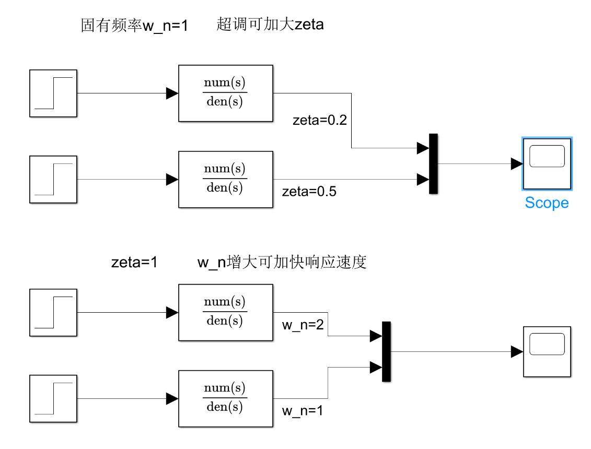
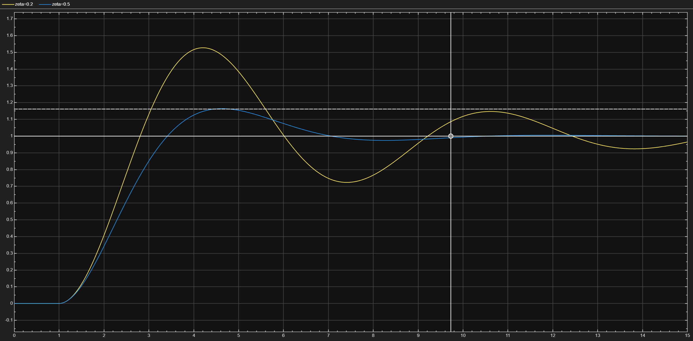
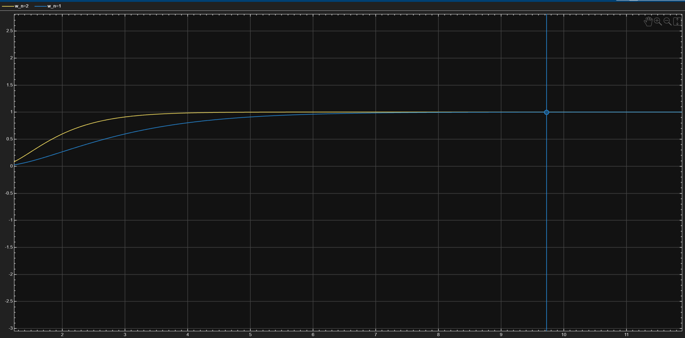

# 二阶系统时域性能指标

## 1. 标准二阶系统传递函数

在进行时域性能分析前，先明确我们讨论的系统数学模型。一个标准二阶系统的传递函数为：

$$ G(s) = \frac{\omega_n^2}{s^2 + 2\zeta\omega_n s + \omega_n^2} $$

## 2. 仿真验证：参数如何影响时域指标？

### 实验 1：固定 ωn=1，改变 ζ

> **观察结论**：ζ 越小（0.2），超调越大、振荡越剧烈；ζ 增大到 0.5，超调明显减小。

### 实验 2：固定 ζ=1，改变 ωn

> **观察结论**：ωn 从 1 增大到 2，上升时间、峰值时间、调节时间全部成比例缩短，系统反应明显变快。
> **理论验证**：各时间指标的分母都含有 ωn 或 ωn√(1-ζ²)，ωn 越大，时间越短。

