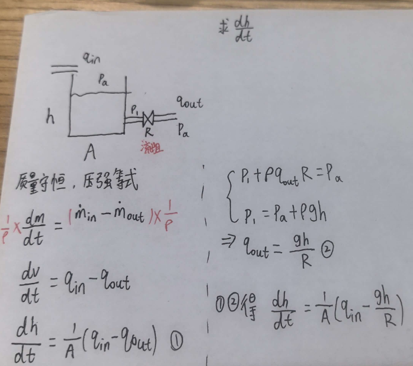
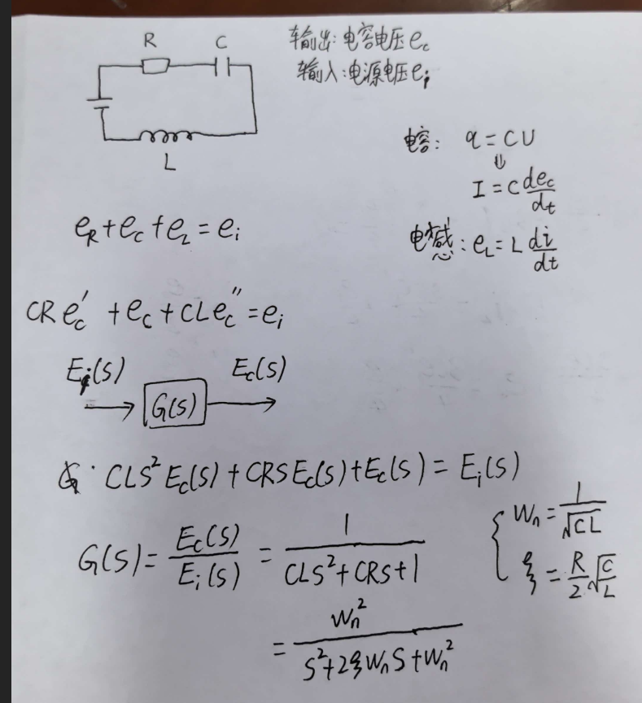
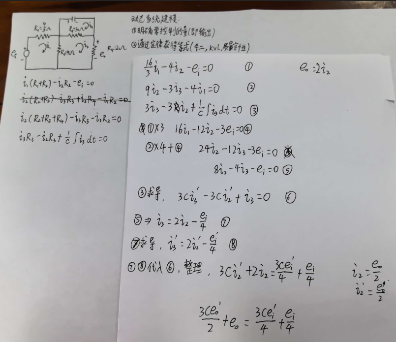
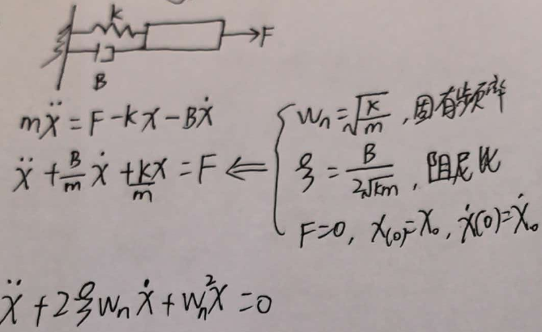

## 动态系统建模大致流程
1. 明确要控制的量(即输出)
2. 分析系统元件的特征(如电感的电压公式e_L=L*di/dt)
3. 找到守恒定律(质量守恒,牛二,基尔霍夫定律)

## 1.简单水箱系统

## 2.RLC电路

## 3.复杂电路

## 4.质量弹簧阻尼系统

## 5.系统的相似之处
| 物理域 |  二阶项系数 | 一阶项系数 | 零阶项系数 | ωn | ζ |
| :--- |  :--- | :--- | :--- | :--- | :--- |
| 弹簧-阻尼 |  m | b | k | √(k/m) | b/(2√(km)) |
| RLC 电路 |  电阻 R | LC | RC | 1 | 1/√(LC) | (R/2)√(C/L) |
