---

# 基于PD的单环与双环控制系统设计

## 本文梗概
1. PID引入 
2. PD控制器的设计
3. 单环PD控制器的缺点
4. 双环控制器的引入

## 重点
1. 零极点对消
2. 单环的缺点
3. 双环引入
4. 控制器的选择

---

## 1. PID引入

公式：
$$ u(t) = K_p e(t) + K_i \int e(t) dt + K_d \frac{de(t)}{dt} $$
其中 $u(t)$ 为输出，$e(t)$ 为误差。$K_p, K_i, K_d$ 分别代表比例、积分、微分系数。

**直观感受：**
* **P（比例）**：加速。误差越大，输出越大。
* **D（微分）**：刹车。根据误差变化率提前预判，提供阻尼，防止超调。
* **I（积分）**：补偿（记忆/消除稳态误差）。对历史误差进行累加，只要误差存在就会累积输出。

### 简单的情景
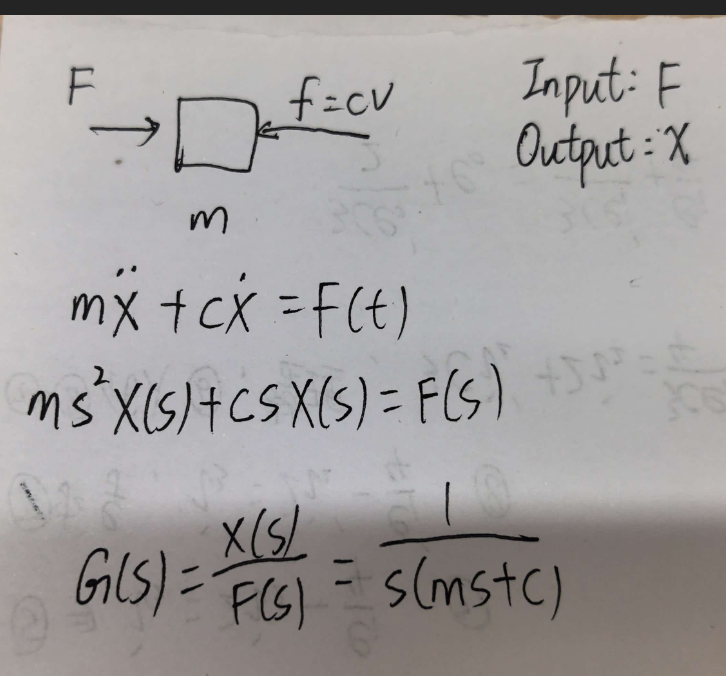
物块受外力和阻尼力，系统输入是外力，输出是物块的位移。牛顿第二定律：$F = m\ddot{x} + b\dot{x}$。
拉普拉斯变换得到被控对象传递函数：
$$ G(s) = \frac{1}{ms^2 + bs} = \frac{1}{s(ms+b)} $$

### 闭环控制系统的传递函数
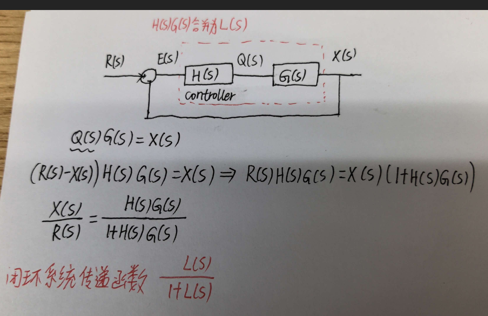
闭环传递函数为：
$$ \frac{X(s)}{R(s)} = \frac{C(s)G(s)}{1 + C(s)G(s)} = \frac{L(s)}{1+L(s)} $$

---

## 2. PD控制器的设计

### 控制器选用PD控制器

**为什么不用纯P？这个我疑惑了很久。**
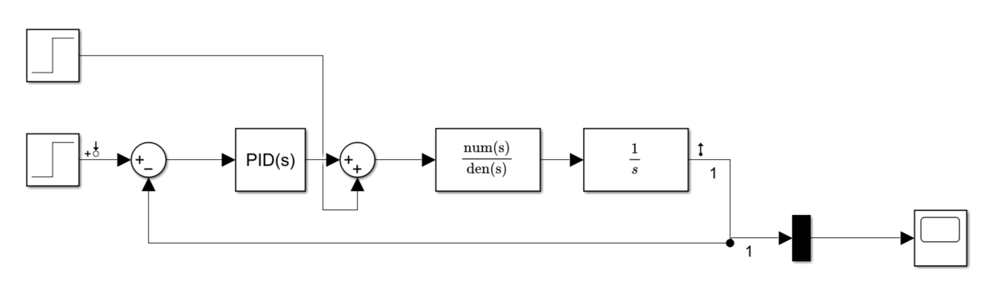
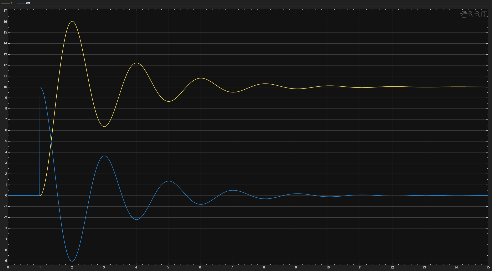
w_c=10;m,b=1;kp=wc

一开始我以为“P会有稳态误差”，但仔细看框图，被控对象自带一个 $\frac{1}{s}$ 积分环节，系统是1型系统。对阶跃目标位置（比如去10米），纯P控制是**没有稳态误差**的。小物块最终真的能停在10米。

**那为什么还要加D？**
直到我在Simulink里跑出波形（黄线冲到16米、来回震荡了五六次）。原来，有积分环节和系统不震荡是两码事。只有P的时候，闭环系统成了一个欠阻尼的二阶系统，阻尼比极小（代入 $m=1, b=1, K_p=10$，算下来大概只有 0.158）。阻尼这么小，系统就像一辆没有减震器的赛车，虽然最终能跑到终点，但一路上疯狂超调、来回震荡。

另外，虽然纯P对“目标位置”没稳态误差，但如果小物块突然遇到外部阻力（扰动），它就必须留下一个 $e_{ss} = \frac{1}{K_p}$ 的偏差才能顶住阻力。

**为什么不用PI？**
被控对象已经自带了一个积分环节，再加个I，传递函数直接变成3阶。相位滞后严重(从G(s)=1/s 的频率响应可以知道)。

**结论：**
选用PD控制器。不仅用D来增加阻尼、消除震荡，还能利用PD的零点去抵消物理对象的极点，直接把系统降成一阶。

整个单环系统框图：
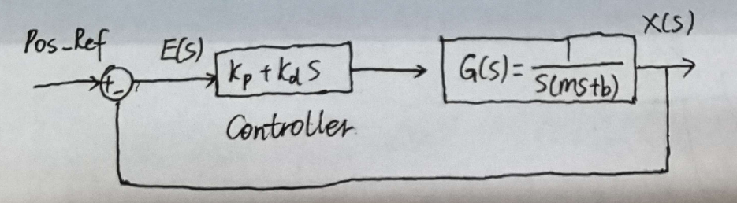

### 设置控制器的思路：零极点对消法

控制器的传递函数：$C(s) = K_p + K_d s = K_d(s + \frac{K_p}{K_d})$

系统开环传函：$L(s) = C(s)G(s) = K_d(s + \frac{K_p}{K_d}) \cdot \frac{1/m}{s(s+b/m)}$

另：
* **$K_p = \omega_c \cdot b$**
* **$K_d = \omega_c \cdot m$**

开环传递函数瞬间简化成了一个极其干净的积分器：
$$ L(s) = \frac{K_d}{m} \cdot \frac{1}{s} $$

最后闭环传递函数为:
$$ \frac{X(s)}{R(s)} = \frac{L(s)}{1 + L(s)} = \frac{\frac{K_d}{m}}{s + \frac{K_d}{m}} = \frac{\omega_c}{s + \omega_c} $$
*(注：至于为什么偏偏要选这种方法、为什么这招在现实中存在巨大隐患，先放在后面的仿真测试里去验证，这里先记住这两个参数公式即可。)*

## Simulink仿真探索
设定小物块目标位置为 10。

### 理想状态：

只要把 $K_p = \omega_c \cdot b$ 和 $K_d = \omega_c \cdot m$ 填入PID控制器，结果非常完美。无论我怎么修改阻尼 $b$、质量 $m$，还是突然增加扰动，输出都无懈可击。

参数图：

添加扰动后的响应：
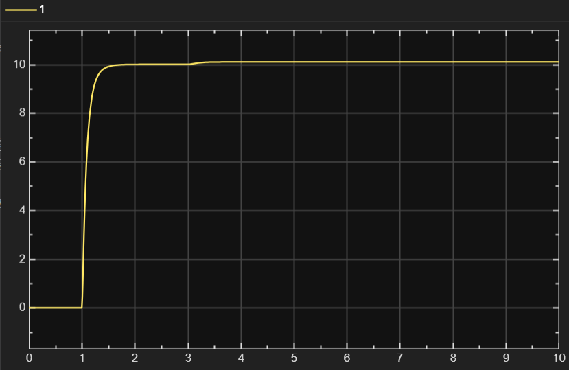

**但很快，我就发现了不对劲的地方：**
这里的 $K_p$ 和 $K_d$ 是**跟着 $m$ 和 $b$ 动态变化**的！现实里的控制器，参数不都是写死的吗？（当然，或许有办法动态修改，比如查表法：检测到阻尼变了，就切到对应的一组 $K_p, K_d$，但这显然很麻烦。）

### 现实一点：固定参数
现在，我把 $K_p$ 和 $K_d$ 写死为 10（相当于固定 $\omega_c = 10$），看看会发生什么：

* **当 $m=1, b=1$ 时**
  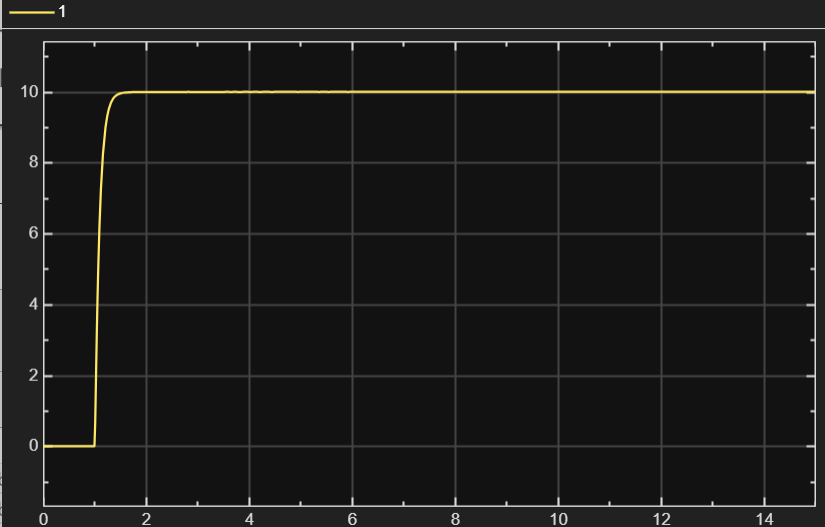
* **当 $m=1, b=3$ 时（模拟遇到粗糙地面）**
  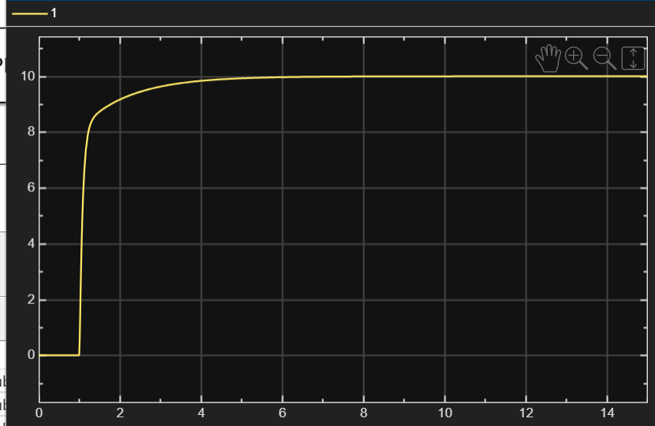
* **当 $m=1, b=1$ 且小物块突然受到干扰时**
  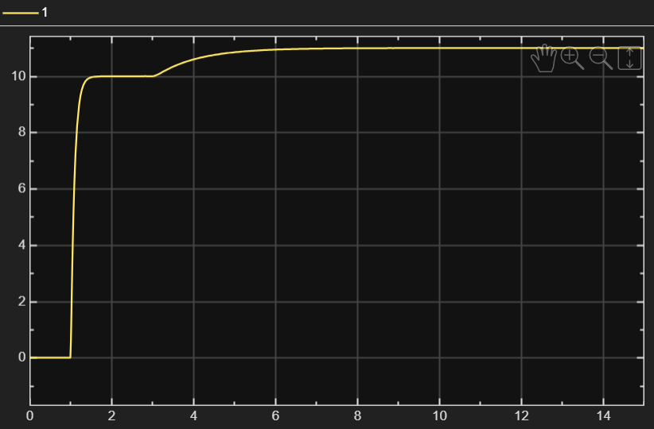
  系统偏离了目标位置，且无法自动恢复。

> **我的疑问：**
> 当把参数写死后，我发现系统的闭环传递函数根本不是最初推导的那个完美一阶系统了。那之前费劲做理想化推导，到底有什么意义呢？为什么 $K_p, K_d$ 偏偏是10？

## 3. 单环PD控制器的缺点

* **参数鲁棒性差**：现实中质量 $m$ 或阻尼 $b$ 增大时，若控制器参数固定，零点与极点不再匹配，系统会超调或变慢。
* **存在稳态误差**：抵抗外力需要 $e_{ss} = \frac{1}{K_p}$ 的恒定偏差，外力不停，偏差永远存在。

## 4. 双环控制器的引入

既然写死参数后，单环系统在现实面前如此脆弱，那该怎么破局？我尝试在Simulink里搭出双环架构：外环位置环（P控制） + 内环速度环（PI控制），内环参数给到 $100$。
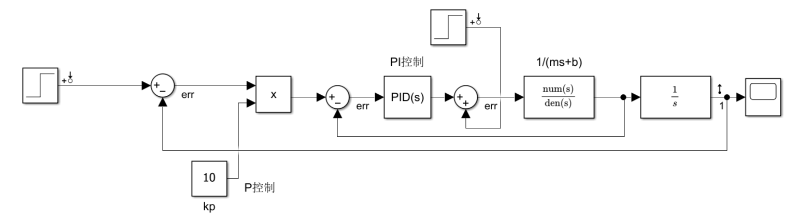

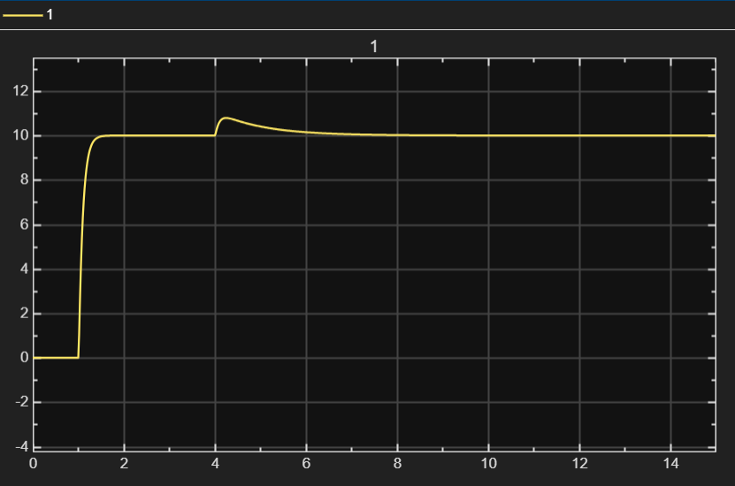
看波形图：小物块在1秒内无超调到达10米。最离谱的是第4秒——我直接往系统里加入一个1000的外力扰动（相当于突然拿大铁锤猛砸小物块）。结果呢波形只是稍微凸起了一点点，然后迅速又被拉回了10米。

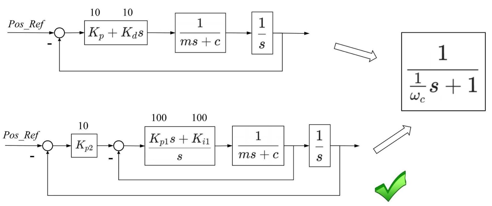
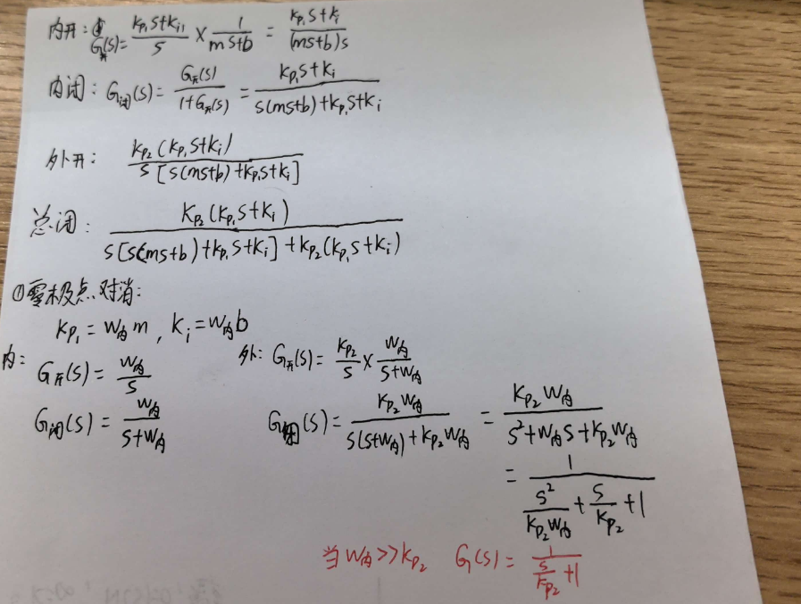

**我试图理解为什么这样设计能这么强：**
内环和外环的分工，就像是“指挥官”与“贴身保镖”。
* **外环（位置环-指挥官）**：只负责发号施令（“我要去10米”），它不负责干脏活累活。因此它只用纯P，输出的是“期望速度”。如果外环也加I，指令就会太沉重，容易引发震荡。
* **内环（速度环-保镖）**：直接面对物理对象。为了死死咬住外环下达的速度指令，内环必须上PI。P负责快速响应，I负责消除速度稳态误差。当第4秒出现1000的扰动时，外环根本不知道发生了什么，内环PI瞬间察觉速度被拖慢，立刻把电流拉满，硬生生把速度顶了回去。
* **带宽解耦**：保镖必须比指挥官快5~10倍（这就是内环参数给到100的原因）。外环的指令还没更新，内环就已经执行完毕了。外环看内环，永远是一个“完美的1”，从而大大简化了外环的调参难度。

---
1. 为什么内环不用PD控制器？
- 内环控制的是1/(ms+b)一个一阶系统,不会超调，引入D会放大噪音。
2. 施加1000N有什么后果？最开始的1s发生了什么?
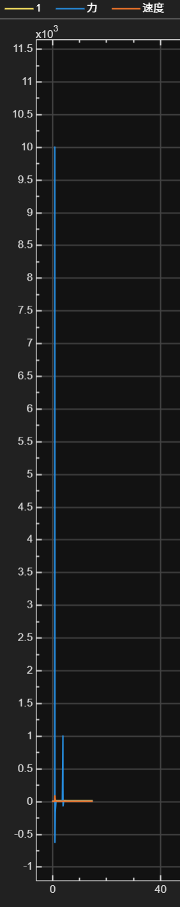
- 在1s时，内环的PI控制器输出了10000的力，在实际工程中要设置上限
3. 外环系数大于内环会怎样？(外为100，内为10)
 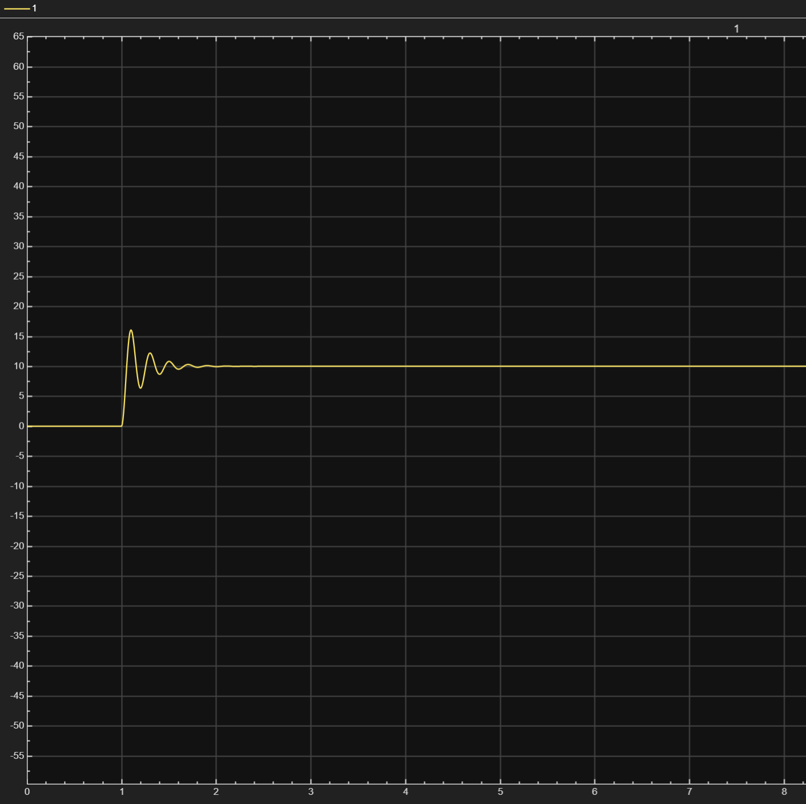
- 系统变为二阶系统，发生震荡
4. 零极点对消的优缺点
- 优点:能将复杂的二阶系统降为一阶,消除超调,简化分析。调参目标也变得极其明确 -- 只需决定期望带宽ωc。
- 缺点:极度依赖精确的数学模型。现实中质量m或阻尼b稍有变化(比如小车载重变了),零点就无法抵消极点,系统瞬间退回二阶,产生震荡。
- 更深层的隐患:对消法其实是在“掩盖”系统的真实物理特性。被消掉的极点往往包含了真实的摩擦和惯性。一旦系统启动、受力饱和或处于高频段,这些被强行掩盖的动态特性就会重新暴露出来,导致理论完美的系统在实际中不堪一击。
---

